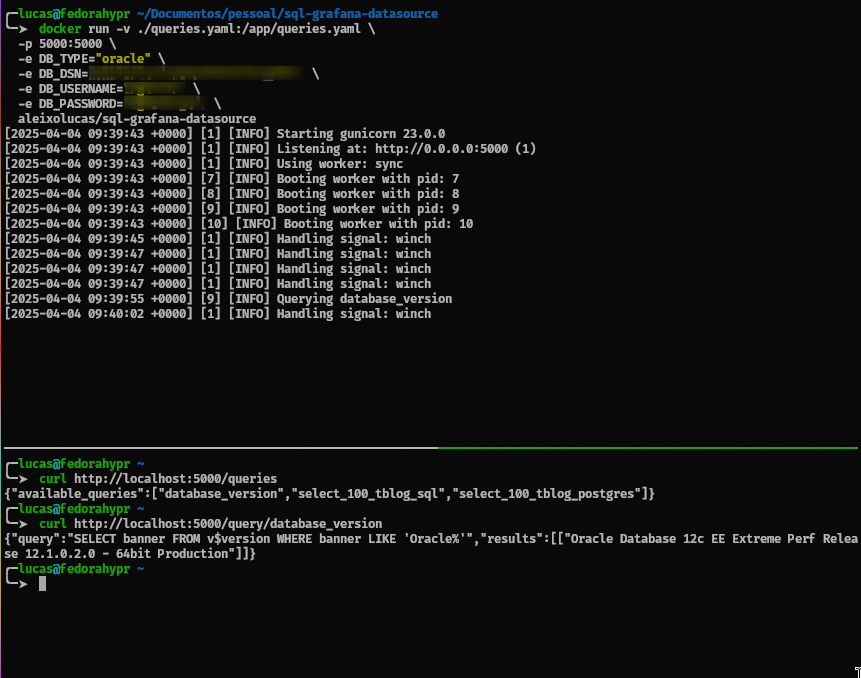
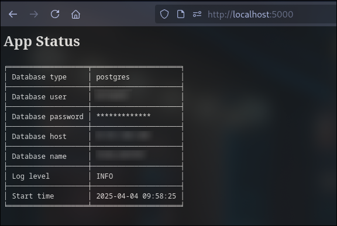

## SQL Grafana Datasource

This is a simple SQL query exporter developed to be used with a Grafana plugin that allows us to get HTTP REST responses, for example, the [`Infinity`](https://grafana.com/grafana/plugins/yesoreyeram-infinity-datasource/) datasource plugin.

## How it works
After configuring the `queries.yaml` file, run the application. The application will load queries from the queries file and expose an HTTP endpoint. You can check available routes at [`/apidocs`](http://localhost:5000/apidocs). To execute a query, use the path `/query/<database-name>/<query-name-configured-on-file>`.

## Queries file example
To get results for the `list_tables` query, you can access `/query/<database-name>/list_tables`.
```yaml
sqlgd:
  list_tables:
    - SELECT table_name FROM user_tables
  database_version:
    - SELECT banner FROM $version WHERE banner LIKE 'Oracle%'
  complex_query:
    - |
      Multiline
      Complex
      Query
      EXAMPLE
```

## Example running with Docker
```bash
# SQL Server
docker run -v ./queries.yaml:/app/queries.yaml \
  -p 5000:5000 \
  -e DB_TYPE="sqlserver" \
  -e DB_USERNAME="user" \
  -e DB_PASSWORD="password" \
  -e DB_SERVER="10.11.12.13" \
  aleixolucas/sql-grafana-datasource

# POSTGRES
docker run -v ./queries.yaml:/app/queries.yaml \
  -p 5000:5000 \
  -e DB_TYPE="postgres" \
  -e DB_USERNAME="user" \
  -e DB_PASSWORD="password" \
  -e DB_SERVER="10.11.12.13" \
  aleixolucas/sql-grafana-datasource

# ORACLE
docker run -v ./queries.yaml:/app/queries.yaml \
  -p 5000:5000 \
  -e DB_TYPE="oracle" \
  -e DB_DSN="10.11.12.13:1521/database" \
  -e DB_USERNAME="user" \
  -e DB_PASSWORD="password" \
  aleixolucas/sql-grafana-datasource
```
Example with **Kubernetes** [here](./kubernetes/)

## Environment variables
### Global
| Variable    | Required | Example                  |
| :---------- | :------: | -----------------------: |
| LOG_LEVEL   |   False  | INFO, WARNING, ERROR, DEBUG |
#### SQL SERVER
| Variable    | Required | Example          |
| :---------- | :------: | ---------------: |
| DB_TYPE     |   True   | sqlserver        |
| DB_USERNAME |   True   | sa               |
| DB_PASSWORD |   True   | s3Cur3_P@$$w0rd  |
| DB_SERVER   |   True   | 10.11.12.13      |

#### POSTGRES
| Variable    | Required | Example          |
| :---------- | :------: | ---------------: |
| DB_TYPE     |   True   | postgres         |
| DB_USERNAME |   True   | postgres         |
| DB_PASSWORD |   True   | s3Cur3_P@$$w0rd  |
| DB_SERVER   |   True   | 10.11.12.13      |
| DB_PORT     |   False  | 5432             |

#### ORACLEDB
| Variable    | Required | Example          |
| :---------- | :------: | ---------------: |
| DB_TYPE     |   True   | oracle           |
| DB_USERNAME |   True   | best_user_ever   |
| DB_PASSWORD |   True   | s3Cur3_P@$$w0rd  |
| DB_DSN      |   True   | 10.11.12.12:1521/PRODUCTION_SALES |

## Curl example


# Setup on Grafana
- Install the Infinity plugin from Grafana Labs
- Add a new datasource and leave the default configuration
- On a dashboard, add a panel
- Select the Infinity datasource plugin
- Set type to JSON, method as GET, Source as URL, Format as Table, and Method as GET
- Fill the URL box with your query URL, example: `http://10.11.12.14:5000/query/<database-name>/database_version`
- Set Grafana visualization from `Time Series` to `Table`

### Troubleshooting
Troubleshooting can be done by checking logs and setting the environment variable `LOG_LEVEL` to `DEBUG`.<br>
At the root URL, you can check your configurations. The password will be displayed only when `DEBUG` is set.<br>

